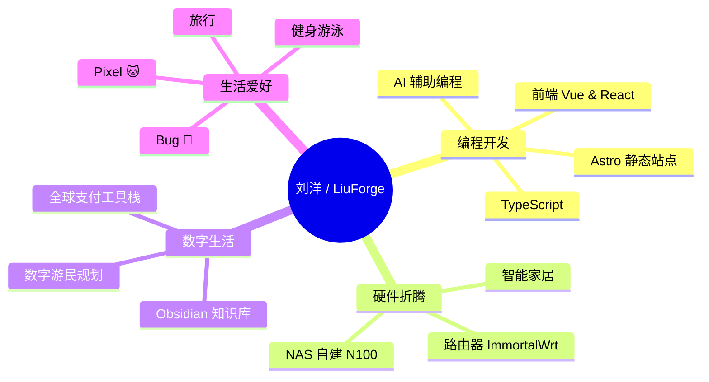

<!-- 动态打字效果 -->

  

<!-- 敲代码图片 -->
 

<!-- 个人徽标 -->

  &emsp;
  &emsp;
  

<!-- 贪吃蛇贡献图 -->
<picture>
  <source media="(prefers-color-scheme: dark)" srcset="https://raw.githubusercontent.com/2385347602/2385347602/output/github-contribution-grid-snake-dark.svg" />
  <source media="(prefers-color-scheme: light)" srcset="https://raw.githubusercontent.com/2385347602/2385347602/output/github-contribution-grid-snake.svg" />
  
</picture>

# 🙋 Hello, I'm 刘洋

<table>
<tr><td>

### 🤺 About Me

&emsp;&emsp;大家好，我是刘洋，一个爱折腾的全栈开发者。

&emsp;&emsp;热爱编程、硬件折腾、数字游民生活方式。

&emsp;&emsp;正在构建 <strong>LiuForge</strong> —— 我的个人工具站、博客与排行榜。

&emsp;&emsp;家里有一只田园犬 <strong>🐶 Bug</strong> 和一只狸花猫 <strong>🐱 Pixel</strong>，它们是我最好的代码审查官。

<strong>&emsp;&emsp;Keep building. Keep shipping. Stay curious.</strong>

</td></tr>

<tr><td>

### 🏢 Work Experience

- **Web 前端开发工程师** &emsp; 📌 在职中
  - 工作内容：前端开发，业余时间折腾 NAS / 路由器 / AI 工作流
  - 当前在研究：Astro + Cloudflare Pages + AI 编程工作流

</td></tr>

<tr><td>

### 🔧 Current Projects

* 🚀 **LiuForge** - 个人博客 + 工具集 + 排行榜，基于 Astro + Cloudflare Pages
* 🛖 **NAS 自建** - N100 平台静音 NAS，Syncthing + Obsidian 知识库同步
* 🌐 **路由折腾** - Xiaomi AX3000T + ImmortalWrt + OpenClash Mihomo 内核
* 🤖 **AI 工作流** - Claude Code + Cursor 提效，Obsidian Copilot + Ollama 本地模型

</td></tr>

<tr><td>

### 🧠 Knowledge Base (Obsidian)

* 📝 前端开发笔记 & 踩坑记录
* 🛠️ 硬件折腾日志（NAS / 路由器）
* 🌍 数字游民工具栈研究
* 💰 个人财务 & 复利思维
* 🪣 人生 Bucket List（已完成 6 / 100）

</td></tr>

<tr><td>

### 🤾‍♂️ Life & Interests

* 📖 在读《纳瓦尔宝典》🌟🌟🌟🌟🌟 力荐
* 🎮 最近在玩：折腾 Homelab
* 🐶 Bug 今天又把玩具咬烂了
* 🐱 Pixel 坐在键盘上 code review
* ✈️ 目标：成为真正的数字游民，边旅行边工作

</td></tr>

</table>

<!-- 技能徽章 -->
💪 主力技术栈

🚀 基础设施 & 工具

🧰 日常使用设备

<!-- GitHub 数据统计 -->

  

<!-- 连续提交记录 -->
&emsp;

&emsp;

  

<!-- GitHub 活动图 -->

<!-- 奖杯 -->
  

<!-- 笑话卡片 -->

<!-- 名言 -->
 

