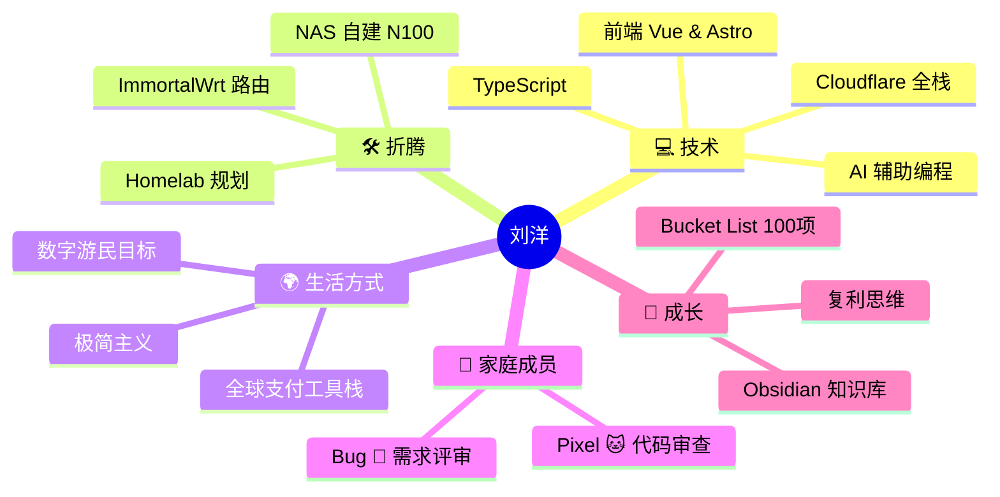

<!-- HEADER -->


<!-- 打字动画 -->
<div align="center">
  
</div>

<br>

<!-- 社交链接 -->
<div align="center">
  <a href="https://liuforge.dev">
    
  </a>
  &nbsp;
  
</div>

<br>

---

## 🧑‍💻 关于我 · About Me

```typescript
const liuyang = {
  name:       "刘洋 · Liu Yang",
  username:   "2385347602",
  location:   "China 🇨🇳  →  World 🌍  (Digital Nomad in Progress)",
  pets:       ["Bug 🐶 田园犬", "Pixel 🐱 狸花猫"],

  currentlyBuilding: "LiuForge — 个人博客 + 工具集 + 排行榜",
  currentlyTinkering: ["N100 NAS 自建", "ImmortalWrt 路由折腾", "AI 工作流"],

  stack:      ["TypeScript", "Vue 3", "Astro", "React", "Cloudflare"],
  tools:      ["Claude Code", "Cursor", "Obsidian", "VS Code"],
  devices:    ["Lenovo Legion Y9000P", "Xiaomi 14 Pro"],

  goal:       "成为真正的独立开发者，边旅行边 ship 产品",
  funFact:    "Bug 负责需求评审，Pixel 负责代码审查，我负责背锅",
};
```

<br>

---

## 🚀 正在做的事 · Now

<table>
  <tr>
    <td width="50%">

### 🔨 Building
| 项目 | 描述 | 状态 |
|------|------|------|
| **LiuForge** | 个人站 + 工具集 + 排行榜 | 🟡 进行中 |
| **NAS 自建** | N100 + TrueNAS + Syncthing | 🟡 规划中 |
| **AI 工作流** | Claude Code + Obsidian 协同 | 🟢 运行中 |

</td>
    <td width="50%">

### 📚 Learning
| 方向 | 内容 |
|------|------|
| **前端** | Astro / Vue 3 / TS 深入 |
| **基础设施** | Cloudflare 生态全栈 |
| **AI** | Prompt Engineering / 本地模型 |
| **硬件** | Homelab / NAS / 网络 |

</td>
  </tr>
</table>

<br>

---

## 🛠️ 技术栈 · Tech Stack

<div align="center">

**前端 & 框架**


**后端 & 数据库**


**工具 & 平台**


</div>

<br>

---

## 📊 GitHub 数据 · Stats

<div align="center">
  
  
</div>

<div align="center">
  
</div>

<br>

<!-- 3D 贡献图 -->
<div align="center">
  
</div>

<br>

---

## 🐍 贡献蛇 · Contribution Snake

<div align="center">
<picture>
  <source media="(prefers-color-scheme: dark)" srcset="https://raw.githubusercontent.com/2385347602/2385347602/output/github-contribution-grid-snake-dark.svg" />
  <source media="(prefers-color-scheme: light)" srcset="https://raw.githubusercontent.com/2385347602/2385347602/output/github-contribution-grid-snake.svg" />
  
</picture>
</div>

<br>

---

## 🏆 奖杯 · Trophy

<div align="center">
  
</div>

<br>

---

## 📈 活动图 · Activity

<div align="center">
  
</div>

<br>

---

## 🧠 思维导图 · Mind Map



<br>

---

<div align="center">

*"Build things. Ship often. Stay curious."*


</div>

<!-- FOOTER -->

